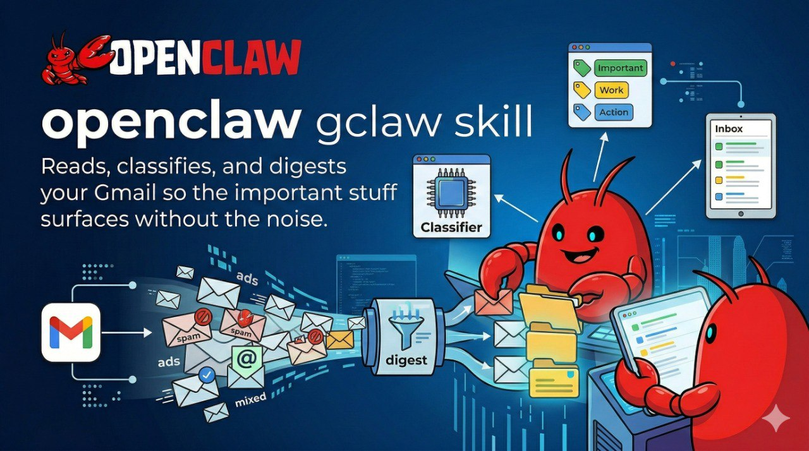

<div align="center">


# GClaw 📬

**Reads, classifies, and digests your Gmail so the important stuff surfaces without the noise.**

[](https://github.com/yhyatt/gclaw)
[](LICENSE)
[](https://clawhub.com/skills/gclaw)

No email client. No dashboards. No manual sorting.  
Just structured email data your bots can actually use.

</div>

---

## The problem with Gmail bots

Every Gmail bot starts the same way: call the API, get a wall of JSON, try to figure out what matters.  
You end up writing the same fetch-parse-classify pipeline from scratch every time.

GClaw is that pipeline, done once, done right.

---

## What GClaw provides

- **EmailFetcher** — fetch by label, deduplicated, cached. Never processes the same email twice.
- **EmailParser** — extracts sender domain, cleans quoted/forwarded content, detects reply chains.
- **EmailClassifier** — 15-category heuristic classification. Zero LLM tokens.
- **EmailStore** — JSONL persistence per bot. Queryable, auditable, portable.
- **BotContext** — isolates each downstream bot to its own label/sender scope.

## Architecture

```
Gmail (via gog CLI)
    └─► EmailFetcher      — fetch + deduplicate
        └─► EmailParser   — clean + structure
            └─► EmailClassifier  — 15 categories, no LLM
                └─► EmailStore  — JSONL, per bot_id
```

## Quick Start

```bash
pip install gog  # Google OAuth CLI — see clawhub.com/skills/gog
export GCLAW_GMAIL_ACCOUNT="your@gmail.com"
export GOG_KEYRING_PASSWORD="your-keyring-password"
pip install -e .
```

```python
from kaimail.bot_context import BotContext
from kaimail.fetcher import EmailFetcher
from kaimail.classifier import EmailClassifier
from kaimail.store import EmailStore

ctx = BotContext(bot_id="digest", allowed_labels=["INBOX"], max_results=50)
fetcher = EmailFetcher(context=ctx)
emails = fetcher.fetch_new()

classifier = EmailClassifier()
for email in emails:
    email.category = classifier.classify(email)
    print(f"[{email.category}] {email.subject}")
```

## Classification Categories

| Category | Examples |
|---|---|
| `newsletter` | Substack, Mailchimp, RSS-style sends |
| `finance` | Invoices, bank alerts, receipts |
| `travel` | Booking confirmations, flight updates |
| `work` | Company domains, internal tools |
| `action_required` | Urgent keywords, deadlines |
| `social` | LinkedIn, Twitter, Facebook |
| `security` | Password resets, 2FA, alerts |
| `calendar` | Meeting invites, event reminders |
| `shopping` | Order confirmations, delivery updates |
| `personal` | Known contacts, direct messages |
| + 5 more | `health` · `legal` · `ads` · `receipt` · `other` |

## Use Cases

- **Email digest bot** — surface what matters each morning
- **Travel bot** — extract itineraries from booking confirmations
- **Finance tracker** — parse receipts and invoices automatically
- **Action tracker** — never miss an email that needs a reply

## Requirements

- Python 3.10+
- [gog](https://clawhub.com/skills/gog) skill (Google OAuth CLI)
- Gmail account with OAuth configured

## License

MIT © [Yonatan Hyatt](https://github.com/yhyatt)
